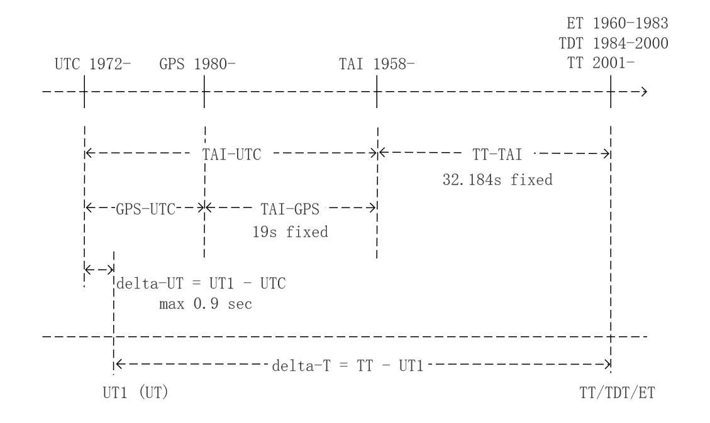

### **TAI**
国际原子时 (英语：International Atomic Time、法语：Temps Atomique International, TAI)
 
1967年第13届国际计量大会上通过一项决议，定义一秒为铯-133原子基态两个超精细能级间跃迁辐射振荡9,192,631,770周所持续的时间。其起点为 **[世界时](#ut)** 1958年的开始（1958 年 1 月 1 日，TAI-UT1 约为 0）。

### UTC
协调世界时（英语：Coordinated Universal Time，法语：Temps Universel Coordonné，简称UTC），与 TAI 相差整数秒。必要时，在 UTC 中引入闰秒，以使 UTC 和 UT 之间的时差小于 0.9 秒。UTC 于 1972 年推出。

### **UT**
世界时（Universal Time，简称UT）是一种以格林威治子夜起算的平太阳时。世界时是以地球自转为基准得到的时间尺度，其精度受到地球自转不均匀变化和极移的影响。以前由天文观测确定，但现在改用 GPS 卫星。 这个时间尺度有点不规则。UT 有多种不同的定义，但它们之间的差异总是小于约 0.03 s。**UT1** 是目前使用的世界时标准。被作为目前世界民用时间标准UTC在增减闰秒时的参照标准。

### **TT**
地球时（英语：Terrestrial Time），简称**TT**，是现代在地球表面上的时间标准，是位于大地海平面体验的原时。在天文学，则为局限在地球上的观测者显示星历表的时间座标。它与地心座标时（Geocentric Coordinate Time）有直接的关联，是天文的地球系统时间标准。由于广义相对论中的引力时间膨胀，地球时的滴答声是恒定的比例，并且比地心座标时缓慢些。

### Delta-T
delta-T 随地球自转而不断变化。

UT1 相对于 UTC 是可变的。 UTC 中引入了闰秒，以使 delta-UT 保持在 +-0.9 秒之内。

TAI-UTC 始终是整数秒，并且在每年年底、每半年或每三个月添加（或删除，但尚未发生）闰秒时会发生变化。 该优先顺序。

### 1972 年至今的时间尺度表及一些预测
TT = TAI+32.184s ==> UT1-UTC = TAI-UTC - (TT-UT1) + 32.184s

|Starting at|    TAI-UTC  |   GPS-UTC|   TT-UT1|    UT1-UTC|
|---|:---:|:---:|:---:|:---:|
|1972-01-01|       +10|       -       |+42.23|    -0.05|
|1972-07-01|       +11|       -       |+42.80|    +0.38|
|1973-01-01|       +12|       -       |+43.37|    +0.81|
|1973-07-01|        " |       -       |+43.93|    +0.25|
|1974-01-01|       +13|       -       |+44.49|    +0.69|
|1974-07-01|        " |       -       |+44.99|    +0.19|
|1975-01-01|       +14|       -       |+45.48|    +0.70|
|1975-07-01|        " |       -       |+45.97|    +0.21|
|1976-01-01|       +15|       -       |+46.46|    +0.72|
|1976-07-01|        " |       -       |+46.99|    +0.19|
|1977-01-01|       +16|       -       |+47.52|    +0.66|
|1977-07-01|        " |       -       |+48.03|    +0.15|
|1978-01-01|       +17|       -       |+48.53|    +0.65|
|1978-07-01|        " |       -       |+49.06|    +0.12|
|1979-01-01|       +18|       -       |+49.59|    +0.59|
|1979-07-01|        " |       -       |+50.07|    +0.11|
|1980-01-01|       +19|       0       |+50.54|    +0.64|
|1980-07-01|        " |       "       |+50.96|    +0.22|
|1981-01-01|        " |       "       |+51.38|    -0.20|
|1981-07-01|       +20|       1       |+51.78|    +0.40|
|1982-01-01|        " |       "       |+52.17|    +0.01|
|1982-07-01|       +21|       2       |+52.57|    +0.61|
|1983-01-01|        " |       "       |+52.96|    +0.22|
|1983-07-01|       +22|       3       |+53.38|    +0.80|
|1984-01-01|        " |       "       |+53.79|    +0.39|
|1984-07-01|        " |       "       |+54.07|    +0.11|
|1985-01-01|        " |       "       |+54.34|    -0.16|
|1985-07-01|       +23|       4       |+54.61|    +0.57|
|1986-01-01|        " |       "       |+54.87|    +0.31|
|1986-07-01|        " |       "       |+55.10|    +0.08|
|1987-01-01|        " |       "       |+55.32|    -0.14|
|1987-07-01|        " |       "       |+55.57|    -0.39|
|1988-01-01|       +24|       5       |+55.82|    +0.36|
|1988-07-01|        " |       "       |+56.06|    +0.12|
|1989-01-01|        " |       "       |+56.30|    -0.12|
|1989-07-01|        " |       "       |+56.58|    -0.40|
|1990-01-01|       +25|       6       |+56.86|    +0.32|
|1990-07-01|        " |       "       |+57.22|    -0.04|
|1991-01-01|       +26|       7       |+57.57|    +0.61|
|1991-07-01|        " |       "       |+57.94|    +0.24|
|1992-01-01|        " |       "       |+58.31|    -0.13|
|1992-07-01|       +27|       8       |+58.72|    +0.46|
|1993-01-01|        " |       "       |+59.12|    +0.06|
|1993-07-01|       +28|       9       |+59.55|    +0.63|
|1994-01-01|        " |       "       |+59.98|    +0.20|
|1994-07-01|       +29|      10       |+60.38|    +0.80|
|1995-01-01|        " |       "       |+60.78|    +0.40|
|1995-07-01|        " |       "       |+61.20|    -0.02|
|1996-01-01|       +30|      11       |+61.63|    +0.55|
|1996-07-01|        " |       "       |+61.96|    +0.22|
|1997-01-01|        " |       "       |+62.29|    -0.11|
|1997-07-01|       +31|      12       |+62.63|    +0.55|
|1998-01-01|        " |       "       |+62.97|    +0.21|
|1998-07-01|        " |       "       |+63.22|    -0.04|
|1999-01-01|       +32|      13       |+63.47|    +0.71|
|1999-07-01|        " |       "       |+63.66|    +0.52|
|2000-01-01|        " |       "       |+63.82|    +0.36|
|2000-07-01|        " |       "       |+63.98|    +0.20|
|2001-01-01|        " |       "       |+64.09|    +0.09|
|2001-07-01|        " |       "       |+64.20|    -0.02|
|2002-01-01|        " |       "       |+64.30|    -0.12|
|2002-07-01|        " |       "       |+64.41|    -0.23|
|2003-01-01|        " |       "       |+64.47|    -0.29|
|2003-07-01|        " |       "       |+64.55|    -0.37|
|2004-01-01|        " |       "       |+64.57|    -0.39|
|2004-07-01|        " |       "       |+64.65|    -0.47|
|2005-01-01|        " |       "       |+64.68|    -0.50|
|2005-07-01|        " |       "       |+64.80|    -0.62|
|2006-01-01|       +33|      14       |+64.85|    +0.33|
|2006-07-01|        " |       "       |+64.99|    +0.19|
|2007-01-01|        " |       "       |+65.15|    +0.03|
|2007-07-01|        " |       "       |+65.34|    -0.16|
|2008-01-01|        " |       "       |+65.45|    -0.27|
|2008-07-01|        " |       "       |+65.63|    -0.45|
|2009-01-01|       +34|      15       |+65.78|    +0.40|
|2009-07-01|        " |       "       |+65.95|    +0.23|
|2010-01-01|        " |       "       |+66.07|    +0.11|
|2010-07-01|        " |       "       |+66.24|    -0.06|
|2011-01-01|        " |       "       |+66.32|    -0.14|
|2011-07-01|        " |       "       |+66.47|    -0.29|
|2012-01-01|        " |       "       |+66.60|    -0.42|
|2012-07-01|       +35|      16       |+66.77|    +0.41|
|2013-01-01|        " |       "       |+66.91|    +0.27|
|2013-07-01|        " |       "       |+67.13|    +0.05|
|2014-01-01|        " |       "       |+67.28|    -0.10|
|2014-07-01|        " |       "       |+67.49|    -0.31|
|2015-01-01|        " |       "       |+67.64|    -0.46|
|2015-07-01|       +36|      17       |+67.86|    +0.32|
|2016-01-01|        " |       "       |+68.10|    +0.08|
|2016-07-01|        " |       "       |+68.40|    -0.22|
|2017-01-01|       +37|      18       |+68.59|    +0.59|
|2017-07-01|        " |       "       |+68.82|    +0.36|
|2018-01-01|        " |       "       |+68.96|    +0.22|
|2018-07-01|        " |       "       |+69.11|    +0.07|
|2019-01-01|        " |       "       |+69.22|    -0.04|
|2019-07-01|        " |       "       |+69.35|    -0.17|
|2020-01-01|        " |       "       |+69.36|    -0.18|
|2020-07-01|        " |       "       |+69.42|    -0.24|
|2021-01-01|        " |       "       |+69.36|    -0.18|
|2021-07-01|        " |       "       |+69.35|    -0.17|
|2022-01-01|        " |       "       |+69.29|    -0.11|
|2022-07-01|        " |       "       |+69.25|    -0.07|
|2023-01-01|        " |       "       |+69.20|    -0.02|
|2023-07-01|        " |       "       |+69.22|    -0.04|
|2024-01-01|        ? |       ?       |+69   |           (pred)|
|2025-01-01|        ? |       ?       |+69   |           (pred)|
|2026-01-01|        ? |       ?       |+69   |           (pred)|
|2027-01-01|        ? |       ?       |+70   |           (pred)|
|2028-01-01|        ? |       ?       |+70   |           (pred)|
|2029-01-01|        ? |       ?       |+70   |           (pred)|

Starting at    TAI-UTC   GPS-UTC   TT-UT1    UT1-UTC

(last updated 2023-07-04)

## 参考
- 1. [https://stjarnhimlen.se/comp/time.html](https://stjarnhimlen.se/comp/time.html)

