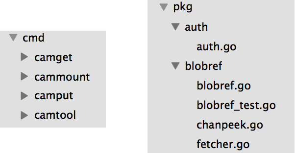

https://go.dev/talks/2013/bestpractices.slide
## 最佳实践
摘自维基百科：
> "最佳实践是一种方法或技术，它始终显示出优于其他方法的结果。
的方法或技术"。
 
编写 Go 代码的技巧：
- 简单
- 可读
- 可维护
 
## 一些代码
```go
type Gopher struct {
  Name string
  AgeYears int
}
```
```go
func (g *Gopher) WriterTo(w io.Writer) (size int64, err error) {
  err = binary.Write(w, binary.LittleEndian, int32(len(g.Name)))
  if err == nil {
    size += 4
    var n int
    n, err = w.Write([]byte(g.Name))
    size += n
    if err == nil {
      err = binary.Write(w, binary.LittleEndian, int64(g.AgeYears))
      if err == nil {
        size += 4
      }
      return
    }
    return
  }
  return
}
```

## 先处理错误，避免嵌套
```go
func (g *Gopher) WriteTo(w io.Writer) (size int64, err error) {
  if err = binary.Write(w, binary.LittleEndian, int32(len(g.Name))); err != nil {
    return
  }
  size += 4
  n, err := w.Write([]byte(g.Name))
  size += int64(n)
  if err != nil {
    return
  }
  err = binary.Write(w, binary.LittleEndian, in64(g.AgeYears))
  if err == nil {
    size += 4
  }
  return
}
```
减少嵌套意味着减轻读者的认知负担。
## 尽可能减少重复
部署一次性实用程序类型，简化代码
```go
type binWriter struct {
  w io.Writer
  size int64
  err error
}
```
```go
// Write 以小端序形式向提供的 writer 中写入值
func (w *binWriter) Write(v interface{}) {
  if w.err != nil {
    return
  }
  if w.err = binary.Write(w.w, binary.LittleENdian, v); w.err == nil {
    w.size += int64(binary.Size(v))
  }
}
```
使用 `binWriter`
```go
func (g *Gopher) WriteTo(w io.Writer) (int64, error) {
  bw := &binWriter{w: w}
  bw.Write(int32(len(g.Name)))
  bw.Write([]byte(g.Name))
  bw.Write(int64(g.AgeYears))
  return bw.size, bw.err
}
```
## 类型转换处理特殊情况
```go
func (w *binWriter) Write(v interface{}) {
  if w.err != nil {
    return
  }
  switch v.(type) {
    case string:
      s := v.(string)
      w.Write(int32(len(s)))
      w.Write([]byte(s))
    case int:
      i := v.(int)
      w.Write(int64(i))
    default:
      if w.err = binary.Write(w.w, binary.LittleEndian, v); w.err == nil {
        w.size += int64(binary.Size(v))
      }
  }
}

func (g *Gopher) WriteTo(w io.Writer) (int64, error) {
  bw := &binWriter{w: w}
  bw.Write(g.Name)
  bw.Write(g.AgeYears)
  return bw.size, bw.err
}
```

## 带有短变量声明的类型转换
```go
func (w *binWriter) Write(v interface{}) {
  if w.err != nil {
    return
  }
  switch x := v.(type) {
    case string:
      w.Write(int32(len(x)))
      w.Write([]byte(x))
    case int:
      w.Write(int64(x))
    default:
      if w.err = binary.Write(w.w, binary.LittleEndian, v); w.err == nil {
        w.size += int64(binary.Size(v))
      }
  }
}
```
## 要么什么都写要么什么都不写
```go
type binWriter struct {
    w   io.Writer
    buf bytes.Buffer
    err error
}

// Write 以小端序形式向提供的 writer 中写入值
func (w *binWriter) Write(v interface{}) {
    if w.err != nil {
        return
    }
    switch x := v.(type) {
    case string:
        w.Write(int32(len(x)))
        w.Write([]byte(x))
    case int:
        w.Write(int64(x))
    default:
        w.err = binary.Write(&w.buf, binary.LittleEndian, v)
    }
}
```
```go
// 如果没有发生错误，Flush 会将任何待处理值写入写入器。
// 如果在 Flush 之前或写入时发生错误，错误信息将被
// 返回。
func (w *binWriter) Flush() (int64, error) {
  if w.err != nil {
    return 0, w.err
  }
  return w.buf.WriteTo(w.w)
}

func (g *Gopher) WriteTo(w io.Writer) (int64, error) {
  bw := &binWriter{w: w}
  bw.Write(g.Name)
  bw.Write(g.AgeYears)
  return bw.Flush()
}
```
## 功能适配器
```go
func init() {
  http.HandleFunc("/", handler)
}

func handler(w http.ResponseWriter, r *http.Request) {
    err := doThis()
    if err != nil {
        http.Error(w, err.Error(), http.StatusInternalServerError)
        log.Printf("handling %q: %v", r.RequestURI, err)
        return
    }

    err = doThat()
    if err != nil {
        http.Error(w, err.Error(), http.StatusInternalServerError)
        log.Printf("handling %q: %v", r.RequestURI, err)
        return
    }
}
```
```go
func init() {
    http.HandleFunc("/", errorHandler(betterHandler))
}

func errorHandler(f func(http.ResponseWriter, *http.Request) error) http.HandlerFunc {
    return func(w http.ResponseWriter, r *http.Request) {
        err := f(w, r)
        if err != nil {
            http.Error(w, err.Error(), http.StatusInternalServerError)
            log.Printf("handling %q: %v", r.RequestURI, err)
        }
    }
}

func betterHandler(w http.ResponseWriter, r *http.Request) error {
    if err := doThis(); err != nil {
        return fmt.Errorf("doing this: %v", err)
    }

    if err := doThat(); err != nil {
        return fmt.Errorf("doing that: %v", err)
    }
    return nil
}
```
## 整理代码
## 重要代码先行
许可证信息、构建标签、软件包文档。
导入语句，相关组用空行隔开。
```go
import (
  "fmt"
  "io"
  "log"

  "golang.org/x/net/websocket"
)
```
其余代码从最重要的类型开始，以辅助函数和类型结束。

## 代码文档
软件包名称，以及之前的相关文档。
```go
// Package playground registers an HTTP handler at "/compile" that
// proxies requests to the golang.org playground service.
package playground
```
导出的标识符出现在 godoc 中，应正确记录。
```go
// Author represents the person who wrote and/or is presenting the document.
type Author struct {
    Elem []Elem
}

// TextElem returns the first text elements of the author details.
// This is used to display the author' name, job title, and company
// without the contact details.
func (p *Author) TextElem() (elems []Elem) {
```
[Gocode: documenting Go code](https://go.dev/blog/godoc-documenting-go-code)

## 越短越好
或者至少越长不总是最好
 
尽量找到最短的名字，不言自明。
- 用 MarshalIndent 替换 MarshalWithIndentation。
 
不要忘记，软件包名称将出现在你选择的标识符之前。
- 在 encoding/json 包中，我们可以找到 Encoder 类型，而不是 JSONEncoder。
- 它被称为 json.Encoder。
 
## 包含多个文件的包
是否应该将软件包分割成多个文件？
- **避免过长文件**
 
标准库中的 `net/http` 软件包包含 `47` 个文件 `15734` 行。
 
- **代码和测试分离**
 
`net/http/cookie.go` 和 `net/http/cookie_test.go` 都是 `http`
软件包的一部分。
 
测试代码只在测试时编译。
 
- **分离包文档**

当我们在软件包中有多个文件时，通常会创建一个包含软件包文档的 `doc.go`
包含软件包文档。

## 让软件包可以 "获取" (go get)
有些软件包可以重复使用，有些则不行。
 
定义某种网络协议的软件包可能会被重复使用，而定义可执行命令的软件包可能不会被重复使用。
 


## APIs
## 提出你的需求
让我们使用之前的 Gopher 类型
```go
type Gopher struct {
    Name     string
    AgeYears int
}
```
我们可以定义这种方法
```go
func (g *Gopher) WriteToFile(f *os.File) (int64, error) {
```
但使用具体类型会使代码难以测试，因此我们使用接口。
```go
func (g *Gopher) WriteToReadWriter(rw io.ReadWriter) (int64, error) {
```
而且，既然我们使用的是接口，就应该只要求我们需要的方法。
```go
func (g *Gopher) WriteToWriter(f io.Writer) (int64, error) {
```
## 保持独立软件包的独立性
```golang
import (
    "golang.org/x/talks/content/2013/bestpractices/funcdraw/drawer"
    "golang.org/x/talks/content/2013/bestpractices/funcdraw/parser"
)
```
```go
    // Parse the text into an executable function.
    f, err := parser.Parse(text)
    if err != nil {
        log.Fatalf("parse %q: %v", text, err)
    }

    // Create an image plotting the function.
    m := drawer.Draw(f, *width, *height, *xmin, *xmax)

    // Encode the image into the standard output.
    err = png.Encode(os.Stdout, m)
    if err != nil {
        log.Fatalf("encode image: %v", err)
    }
```


