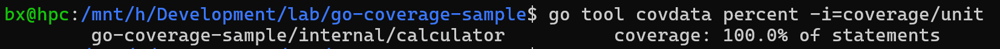
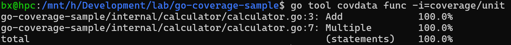

## 项目结构
```
.
├── cmd
│   └── add
│       └── main.go
├── go.mod
└── internal
    └── calculator
        ├── calculator.go
        └── calculator_test.go
```
创建文件 `internal/calculator/calculator.go`
```go
package calculator

func Add(a, b int) int {
	return a + b
}

func Multiple(a, b int) int {
	return a * b
}
```
创建文件 `internal\calculator\calculator_test.go`
```go
package calculator

import "testing"

func TestAdd(t *testing.T) {
	samples := []struct{ a, b, expect int }{
		{1, 2, 3},
		{2, 3, 5},
		{3, 5, 8},
		{3, 6, 9},
	}

	for _, p := range samples {
		if result := Add(p.a, p.b); p.expect != result {
			t.Fatalf("%d + %d should be equal to %d but got %d", p.a, p.b, p.expect, result)
		}
	}
}

func TestMuliple(t *testing.T) {
	samples := []struct{ a, b, expect int }{
		{1, 2, 2},
		{2, 3, 6},
		{3, 5, 15},
	}

	for _, p := range samples {
		if result := Multiple(p.a, p.b); p.expect != result {
			t.Fatalf("%d * %d should be equal to %d but got %d", p.a, p.b, p.expect, result)
		}
	}
}
```
创建文件 `cmd\add\main.go`
```go
package main

import (
	"fmt"
	"log"
	"os"
	"strconv"

	"go-coverage-sample/internal/calculator"
)
package main

import (
	"fmt"
	"log"
	"os"
	"strconv"

	"go-coverage-sample/internal/calculator"
)

func main() {
	if len(os.Args) != 3 {
		log.Fatal("expected two numbers as arguments")
	}

	a, err := strconv.Atoi(os.Args[1])
	if err != nil {
		log.Fatalf("expected %q to be an int", os.Args[1])
	}

	b, err := strconv.Atoi(os.Args[2])
	if err != nil {
		log.Fatalf("expected %q to be an int", os.Args[2])
	}

	fmt.Println(calculator.Add(a, b))
}

func main() {
	if len(os.Args) != 3 {
		log.Fatal("expected two numbers as arguments")
	}

	a, err := strconv.Atoi(os.Args[1])
	if err != nil {
		log.Fatalf("expected %q to be an int", os.Args[1])
	}

	b, err := strconv.Atoi(os.Args[2])
	if err != nil {
		log.Fatalf("expected %q to be an int", os.Args[2])
	}

	fmt.Println(calculator.Add(a, b))
}
```
## 测试验证
作为合理性检查，单元测试应该通过，我们可以通过运行以下程序来构建我们的程序：
```go
go test ./...
go build -o /dev/null ./cmd/add/
```

## 运行单元测试以收集覆盖率
go1.20 以前
```
go test -coverprofile=c.out ./...
```
Go 1.20 中，有一种方法可以指示 go test 创建二进制覆盖率报告
```go
mkdir -p coverage/unit
go test -cover ./... -args -test.gocoverdir="$PWD/coverage/unit"
```
以百分数形式显示覆盖率报告
```
go tool covdata percent -i=coverage/unit
```
类似如下：

覆盖率报告中显示函数名
```
go tool covdata funcs -i=coverage/unit
```
类似如下：

