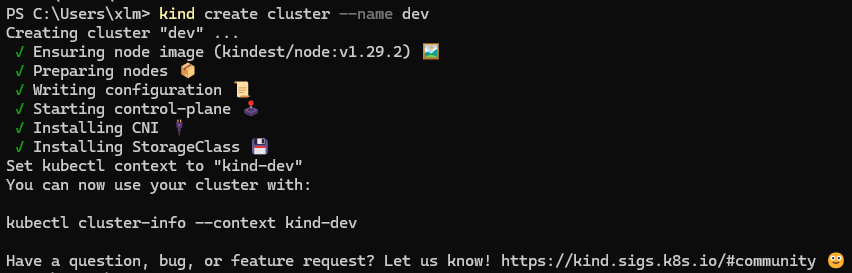
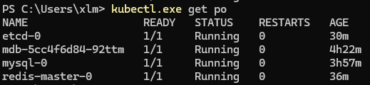

## 安装 Kind
> Kind 需要 [docker](https://docs.docker.com/engine/install/) 或者 [podman](https://podman.io/docs/installation)，确保二者之一已安装
 
有 `go` 环境，直接 `go install`
```shell
go install sigs.k8s.io/kind@v0.22.0
```
或者通过包管理器安装，具体参考：[https://kind.sigs.k8s.io/docs/user/quick-start/#installing-with-a-package-manager](https://kind.sigs.k8s.io/docs/user/quick-start/#installing-with-a-package-manager)

安装好之后，可以使用 `kind create cluster` 创建一个本地 kubernetes 集群。
如需自定义更多选项，查看 `kind -h`。
本地安装一个集群名称为 `dev` 的示例:


## 安装 Helm
参考：[https://helm.sh/docs/intro/install/#from-the-binary-releases](https://helm.sh/docs/intro/install/#from-the-binary-releases)

## 安装一些常用中间件
|名称|shell 脚本|helm chart|
|:---:|:---|:---:|
|mongodb|```helm install mdb oci://registry-1.docker.io/bitnamicharts/mongodb --set fullnameOverride=mdb --set auth.rootUser=root --set auth.rootPassword=root123```|[参考](https://artifacthub.io/packages/helm/bitnami/mongodb)|
|mysql|```helm install mysql oci://registry-1.docker.io/bitnamicharts/mysql --set fullnameOverride=mysql --set auth.rootPassword=root123 --set architecture=standalone```|[参考](https://artifacthub.io/packages/helm/bitnami/mysql)|
|redis|```helm install redis oci://registry-1.docker.io/bitnamicharts/redis --set fullnameOverride=redis --set global.redis.password=root123 --set architecture=standalone --set auth.enabled=true```|[参考](https://artifacthub.io/packages/helm/bitnami/redis)|
|etcd|```helm install etcd oci://registry-1.docker.io/bitnamicharts/etcd --set fullnameOverride=etcd --set auth.rbac.enabled=true --set auth.rbac.rootPassword=root123```|[参考](https://artifacthub.io/packages/helm/bitnami/etcd)|

### 查看运行中的 `Pod` 实例
```shell
kubectl get pods
```


### 暴露集群中的 Pod 端口到本地网络
```shell
kubectl port-forward pod/<POD_NAME> xxx:xxx
```
其中 `POD_NAME` 替换为具体 POD 名称，`xxx:xxx` 为主机到容器的端口映射, 如映射 redis 端口到主机 `kubectl port-forward pod/redis-master-0 6379:6379`后，在主机网络可以通过 `127.0.0.1:6379` 实现访问 `redis`。